# 👤 Author

**Giga Lu** - *AI Engineer & Tech Lead*

> *This project is a portfolio demonstration of Agentic AI capabilities.*

---

# 🏭 Agentic RAG Reporting System: EV Smart Factory


An advanced **Agentic AI Analytics System** designed for Electric Vehicle (EV) manufacturing. This project demonstrates how to combine **Generative AI**, **RAG (Retrieval-Augmented Generation)**, and **Structured Data Analysis** to act as an autonomous "Chief Engineer Assistant."

This project exemplifies **Business Process Redesign (BPR)** by shifting the traditional reporting paradigm—from manual, siloed data gathering to autonomous, intelligent insight generation. It acts as a cognitive bridge between raw factory data and executive decision-making.

> **🚀 Key Highlight:** It doesn't just chat—it *plans* queries, analyzes disparate data sources (Logs + SQL-like CSVs), generates professional **Google Slides Reports** automatically, and learns from **Human-in-the-Loop** feedback.

--

## 🚀 Business Value & Strategic Impact

This system addresses key bottlenecks in modern manufacturing operations:

* **⚡ Accelerating Digital Transformation:** Moves beyond simple dashboards to **Agentic Workflows**, where AI proactively plans and retrieves information across data silos.
* **🔄 Business Process Redesign (BPR):** Automates the end-to-end "Data-to-Insight-to-Presentation" lifecycle, reducing the time required for Root Cause Analysis (RCA) by estimated 80%.
* **📉 Operational Excellence:** Breaks down barriers between **Structured Data** (SQL/CSVs) and **Unstructured Knowledge** (Engineering Logs) to provide a holistic view of production health.
* **🤖 Cognitive Automation:** Empowers engineers to interact with complex data lakes using natural language, fostering **Data Democratization**.

---

## 📺 System Demo


*(Place your Streamlit dashboard screenshot or a GIF of the thinking process here)*

---

## 🧠 System Architecture

The system follows a multi-stage **Agentic Workflow**:

```mermaid
graph TD
    User[User Query] --> Planner[🧠 Strategic Planning Agent]
    Planner -->|Intent Analysis| Router{Intelligent Router}
    
    subgraph "Data Silo Integration"
        Router -->|'LOGS_ONLY'| RAG[📄 Unstructured Data Retriever]
        Router -->|'CSV_ONLY'| Pandas[📊 Structured Data Analyst]
        Router -->|'BOTH'| Hybrid[🔄 Cross-Domain Synthesis]
    end
    
    Router -->|'OUT_OF_SCOPE'| Guard[🛡️ Enterprise Guardrails]
    
    RAG --> LLM[Gemini 3.0 Flash]
    Pandas --> LLM
    
    LLM --> UI[Rich Interface]
    UI -->|Process Automation| Slides[googleslides_icon Auto-Generated Executive Decks]
    UI -->|Continuous Improvement| HITL[Human-in-the-Loop Feedback Loop]
```



## ✨ Key Features

### 1. 🧭 Intelligent Planning Agent

* Instead of blindly answering, the agent **plans** its approach.
* Determines if a query requires checking manufacturing logs (`unstructured`), production stats (`structured`), or both.
* **Guardrails**: Automatically rejects out-of-scope queries (e.g., "Tell me a joke") to maintain professional integrity.

### 2. 🔍 Hybrid RAG (Retrieval-Augmented Generation)

* **Unstructured Data**: Uses vector search (LlamaIndex) to find specific error logs (e.g., "Error E-301 on Station 4").
* **Structured Data**: Analyzes CSV datasets (Performance, Manufacturing, Quality Issues) using Pandas.
* **Synthesis**: Combines both sources to provide root-cause analysis (e.g., correlating a Firmware Version with specific Battery SoH drops).

### 3. 📊 Automated Google Slides Reporting

* One-click export function.
* Converts the AI's analysis into a formatted **Google Slide presentation**.
* **Smart Formatting**: Auto-splits long text into multiple slides, applies corporate branding (colors/fonts), and cleans markdown syntax.

### 4. 🤝 Human-in-the-Loop (HITL)

* Integrated feedback mechanism (👍/👎).
* Captures user feedback to a JSON log (`feedback_log.json`) for future fine-tuning and evaluation.

### 5. 💻 Dual Interfaces

* **Web Dashboard (Streamlit)**: Rich UI with real-time Plotly charts, chat interface, and sidebar controls.
* **Terminal (Rich CLI)**: Hacker-style CLI for quick queries and debugging.

---

## 🛠️ Tech Stack

* **LLM**: Google Gemini 3.0 Flash (via `google-genai` SDK)
* **Framework**: Streamlit (Web), Rich (CLI)
* **Data Processing**: Pandas (Dataframe Manipulation)
* **Knowledge Base**: LlamaIndex (Vector Store & Search)
* **Visualization**: Plotly Express
* **Slide Auto-Generator**: Google Slides API
* **Language**: Python 3.11+

---

## 🚀 Getting Started

### Prerequisites

* Python 3.10+
* A Google Cloud Project with **Gemini API** and **Google Slides/Drive API** enabled.

### 1. Clone the Repository

```bash
git clone [https://github.com/your-username/agentic-rag-reporting.git](https://github.com/your-username/agentic-rag-reporting.git)
cd agentic-rag-reporting

```

### 2. Install Dependencies

```bash
pip install -r requirements.txt

```

### 3. Configuration (.env)

Create a `.env` file in the root directory:

```ini
GEMINI_API_KEY=your_google_ai_studio_key_here

```

### 4. Setup Google Credentials (For Slides)

1. Go to Google Cloud Console.
2. Create a Service Account and download the JSON key.
3. Rename it to `service_account.json` and place it in the project root.
4. Enable **Google Slides API** and **Google Drive API**.

### 5. Generate Synthetic Data

Run the scripts to populate the `data/` folder with realistic factory data:

```bash
python generate_data.py  # Generates CSVs
python generate_log.py   # Generates Error Logs

```

---

## 🏃 Usage

### Option A: Web Dashboard (Recommended)

Launch the full interactive dashboard:

```bash
streamlit run app.py

```

### Option B: CLI Agent

Run the terminal-based agent for quick debugging:

```bash
python main.py

```

---

## 📂 Project Structure

```text
├── app.py                 # Streamlit Web Application
├── main.py                # CLI Entry Point
├── rag_agent.py           # Core Agent Logic (Coordinator)
├── planning_agent.py      # The "Brain" (Router)
├── log_analyzer.py        # RAG Implementation
├── slide_generator.py     # Google Slides Automation
├── feedback_manager.py    # HITL Feedback System
├── data/                  # CSV Datasets
└── logs/                  # Unstructured Log Files

```

---

## 🔮 Future Roadmap

* [ ] **SQL Integration**: Connect to a live SQL database instead of CSVs.
* [ ] **Fine-tuning**: Use the `feedback_log.json` to fine-tune a smaller Gemini model.
* [ ] **Voice Interface**: Add Speech-to-Text for factory floor voice commands.

---

